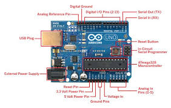
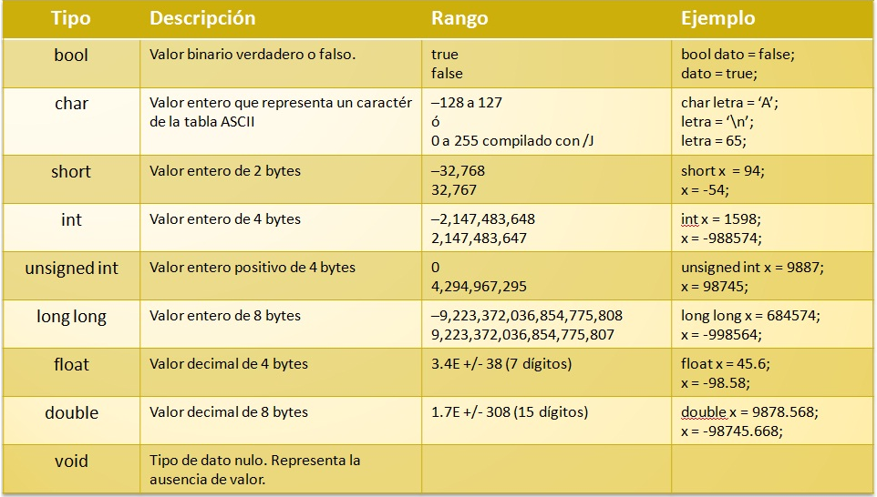
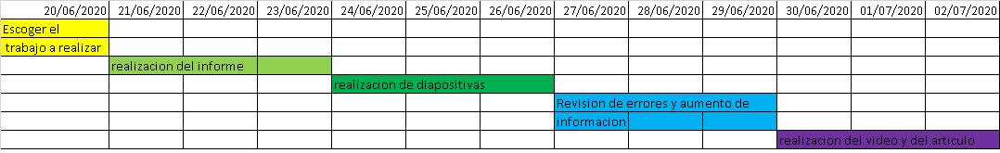

<H2>INFORME</H2>

<H3>1. PLANTEAMIENTO DEL PROBLEMA</H3>

Un bot de charla o bot conversacional (en inglés, chatbot) es un programa que simula mantener una conversación con una persona al proveer respuestas automáticas a entradas hechas por el usuario. Habitualmente, la conversación se establece mediante texto, aunque también hay modelos que disponen de una interfaz de usuario multimedia. Más recientemente, algunos comienzan a utilizar programas conversores de texto a sonido (CTV), dotándolo de mayor realismo a la interacción con el usuario.(Iescamp 2016).

Un chatbot es una aplicación de inteligencia artificial (IA) que puede imitar una conversación real conversation con un usuario con un lenguaje natural.Para establecer una conversación han de utilizarse frases fácilmente comprensibles y que sean coherentes, aunque la mayoría de los bot conversacionales no consiguen comprender del todo.(Wikipedia, 2020).

<H3>2. OBJETIVOS</H3>
<b>Objetivos Generales</b>

- Realizar un video en el cual se pueda ejemplificar el uso de un chatboy con IBM.

<b>Objetivos Específicos</b>

- REmplear las herramientas que nos brinda IBM Watson.

- Implementar un ejemplo funcional sobre un chatbot.

<H3>3. ESTADO DEL ARTE</H3>
<b>Riego inteligente basado en Arduino utilizando sensor de flujo de agua, sensor de humedad del suelo, sensor de temperatura y módulo WiFi ESP8266</b> 

La computadora de placa única Raspberry Pi (SBC) ha ganado popularidad en diversas áreas, mientras que la educación sigue siendo el impulsor fundamental detrás del diseño. Bajo los kits de costos son provistos, específicamente para educación, por Fundación Raspberry Pi en conjunto con Google. Estos kits Modificaciones son usados para resultados educativos óptimos. El tutorial consiste en ejemplos de proyectos y ejemplos de código que pueden ser adaptado rápidamente para diversas situaciones de aprendizaje. Una lista de hardware o BOM, poblada y optimizada para un aprendizaje rentable y efectivo será proporcionado. La familia Raspberry Pi y la familia Arduino también se puede usar para educación, como alternativas o en combinación con la Raspberry Pi Zero y las diferencias serán destacadas y discutidas. Numerosas webs están en continua evolución de recursos, así como implementaciones de hardware financiadas por crowdfunding están disponibles para adaptarlos a la educación, la configuración se discutirá brevemente.   
Nuestro objetivo es describir el uso de Single Board Computadoras (SBC) como Raspberry Pi y Microcontroladores como Arduino en la creación rentable de soluciones para promover la educación STEM en países en desarrollo. Nuestra experiencia ha sido principalmente con Raspberry Pi y por eso escribimos sobre ese sistema. Esto no es una recomendación y es solo un modelo. Varios SBC y Los microcontroladores están disponibles en el mercado y potencialmente incluso los nuevos pueden diseñarse según sea necesario. Una comparación y un ajuste ideal para un conjunto dado de escenarios de instrucción son fuera del alcance de este trabajo. Hay varios recursos disponibles para este propósito(Yamanoor, N. S., & Yamanoor, S. (2017)).  
 <b>Diseño e implementacion de un hogar con sistema de automatizacion basado en teledeteccion tecnica con microcontrolador Arduino Uno</b> 
Este artículo propone y demuestra una forma económica y fácil de utilizar un sistema de riego controlado basado en arduino. El sistema se ocupa de varios factores ambientales como la humedad, temperatura y cantidad de agua requerida por los cultivos utilizando sensores como sensor de flujo de agua, sensor de temperatura y suelo, sensor de humedad. Los datos son recopilados y recibidos por arduino que se puede vincular a un sitio web interactivo que muestra los valores en tiempo real junto con los valores estándar de diferentes factor requerido por un cultivo. Esto permite al usuario controlar el riego. Bombas y rociadores a larga distancia a través de un sitio web y para cumplir con los valores estándar que ayudarían al agricultor a rendir cultivos máximos y de calidad. Estudios realizados en laboratorio. el prototipo sugirió que el sistema diseñado sea aplicable, el cual puede ser implementado.  
La evolución de la tecnología de la información ha abierto puertas a muchas imposibilidades. Con los años, nuestros teléfonos celulares, tabletas, automóviles, el auge de la tecnología "inteligente" ha consumido el mercado y se han convertido en el nuevo estándar en las industrias. El riego inteligente es una de esas tecnologías que ha atraído interés de muchos investigadores y está evolucionando y mejorando desde aproximadamente una década.Esta industria de riego inteligente donde el agua el desperdicio se minimiza y ya no es sostenible socialmente, económica y convencionalmente también(Singh, P., & Saikia, S. (2016)).  
<b>Sistema de gestión de inventario inteligente basado en IoT para Cocina con sensores de peso, LDR, LED, Wi-Fi Arduino Mega y NodeMCU (ESP8266) Módulo con sitio web y aplicación</b>

Sistema inteligente de gestión de inventario de cocina(SIMS) es un sistema basado en IoT, que hará manejo de inventario de cocina, medicina, restaurante más eficiente y sin problemas. Esto no solo notificará a los usuarios de su inventario actual, pero también ordena automáticamente nuevos artículos si la cantidad es baja. Los usuarios también pueden ordenar manualmente en línea para obtener cualquier artículo entregado en su puerta directamente desde sus SIMS aplicación El usuario también puede generar una lista de un período de tiempo determinado para que el usuario podrá saber sobre sus gastos. Además, el usuario puede rastrear el estado de su pedido y su historial a través del sitio web. Con la ayuda de Smart Kitchen Inventory (SKI), una parte de SIMS, la gente puede olvidarse de la molestia de comprar comestibles como puede ser operado desde cualquier lugar a través del sitio web o el Android aplicación y pedir todo lo que necesiten cuando lo deseen..  
La extensión de la tecnología es ineludible. Cada innovación se crea para tener un impacto constructivo en la vida de los humanos. En la era del avance tecnológico, todos los días se están construyendo nuevas ideas y prototipos que se están apoderando en algunos campos de nuestras actividades diarias. Estas tecnologías han facilitando la vida de todos, incluso más de lo que cualquiera puede pensar. Aunque la vida se hace más fácil, las personas también pasan más ocupadas a medida que pasa cada día. Las personas no tienen tiempo para simples tareas como ir de compras, que es simple pero necesario para una casa. A medida que avanzamos hacia la digitalización, nuestra vida y nuestros estilos de vida son cada vez más inteligentes. Ahí son múltiples dispositivos inteligentes ya disponibles en el mercado, como teléfono, TV, etc.Además, la cocina es un lugar importante en la casa que se compone de muchos dispositivos inteligentes que están destinados a proporcionar mejores servicios para un hogar. Es solo un asunto de tiempo que la gente va a necesitar un dispositivo inteligente para manejar sus comestibles. Anteriormente Samsung, LG hizo una nevera inteligente. Sin embargo, este refrigerador inteligente solo puede ayudar a ver lo que hay dentro de la nevera desde un lugar remoto y los usuarios tienen que ir de compras solos. Muchas personas habían trabajado previamente en el sistema de gestión de inventario de los hogares y E-shopping por separado(Rezwan, S., Ahmed, W., Mahia, M. A., & Islam, M. R. (2018)).  

<H3>4. MARCO TEORICO</H3>
 <b>Chatbot
</b>
Los chatbots tienen su origen en 1966, cuando Joseph Weizenbaum creó el primer chatbot basado en inteligencia artificial, Eliza, que actuaba como terapeuta.Los más avanzados, son programas capaces de mantener una conversación lógica y pseudo inteligente en un determinado idioma. Algunos de los más complejos están programados en C++, Delphi o similares, y otros más sencillos en Action Script, PHP, VBScript, etc. Pueden ser consultados además de mediante software instalado en un ordenador personal, vía web y vía aplicaciones instaladas en teléfonos inteligentes (entre las mismas, cabe mencionar a Siri y SimSimi,entre otros muchos). Existen muchos otros con amplia presencia en redes de IRC, donde son conocidos como bots de charla o bots de chat.(RoboticaSchool,2020)

<b>IBM Watson</b>

•	Watson es un sistema informático para búsqueda de respuestas (question answering en inglés), desarrollado por IBM. La corporación lo describe como "una aplicación de tecnologías avanzadas diseñadas para el procesamiento de lenguajes naturales, la recuperación de información, la representación del conocimiento, el razonamiento automático, y el aprendizaje automático al campo abierto de búsquedas de respuestas," que es "construido en la tecnología DeepQA de IBM para la generación de hipótesis, la recopilación de pruebas masivas, el análisis y la calificación.Watson responde a las preguntas gracias a una base de datos almacenada localmente. La información contenida en esa base de datos proviene de multitud de fuentes, incluyendo enciclopedias, diccionarios, tesauros, artículos de noticias, y obras literarias, al igual que bases de datos externos, taxonomías, y ontologías (específicamente DBpedia, WordNet).(Wikipedia,2012-2018)

<H3>5. DIAGRAMAS</H3>

<H3>6. LISTA DE COMPONENTES</H3>
<b>IBM Watson</b>

- Accseso a internet
- Correo electronico
- Cuenta en IBM Watson
- Idea o nesecidad para plantear el chatbot
- Accseso a un computador

<H3>7. MAPA DE VARIABLES</H3>

<H3>8. EXPLICACION DEL CODIGO FUENTE</H3>
El codigo fuente en si no existe de la simulacion de la tarjeta ESP8266 pero hay un codigo de un ejemplo parecido con señales externas

<b>Simulador señales infrarojas</b>

int sensor = 0;

void setup()

{

  pinMode(9, INPUT);

  Serial.begin(9600);

  pinMode(7, OUTPUT);

}

void loop()

{

  sensor = digitalRead(9);

  Serial.println(sensor);

  if (sensor == 0) {

    digitalWrite(7, HIGH);

    delay(1000); //Para poder ver el cambio

  }

  if (sensor == 1) {

    digitalWrite(7, LOW);

  }

  delay(10);

}

Se inicializa la variable entera sensor con 0, colocamas una variable de tipo void(vacio) en setup, Se le ingresa el valor de 9 al pin y por ende sale el valor 7, se le coloca el print que es para mostrar en la pantalla lo que pasa con el sensor al momento de realizar la entrada de datos, se le coloca un condicional if para el canso en que vale 0 la intensidad de luz del led se aumenta por arriba de 7 con un overlay de 1000, y para cuando es 1 la intensidad se baja de 7 con un overlay de 10, esto nos permite demostrar que dependiendo de las señales externas que recibamos en nuestro circuito a travez de un sensor, en este caso sensor infrarojo, ocurre una intensidad de iluminacion diferente en el led

<H3>9. DESCRIPCION DE PRERREQUISITOS Y CONFIGURACION</H3>
Se debe tener una cuenta en la plataforma de Tinkercad para poder utilizar sus servicios.

En el caso de que hubiera funcionado la simulacion de ESP8266 se necesitaria una cuenta en ThingSpeak como es el caso contrario no se necesita nada adicional para la simulacion de infrarojo

<H3>10. APORTACIONES</H3>
<b>SBC</b>

El SBC (Session Border Controller) es un nuevo componente al alcance de las empresas. Se puede instalar como un appliance o máquina virtual y dispone de funcionalidades que harán que su red de telefonía IP sea mucho más segura y se integre mejor con el equipamiento SIP de diferentes fabricantes y proveedores de servicios.
Básicamente, el SBC gestiona tanto la media como la señalización de las llamadas VoIP.
Las funciones principales de un SBC son las siguientes:
•    SEGURIDAD: Uno de los roles principales de estos equipos es proteger, mediante una de capa de seguridad adicional,  los puntos de entrada al sistema de voz ip desde las redes no seguras, evitando el hacking y los fraudes telefónicos. El SBC oculta al exterior la topología de red interna, actuando como un firewall pero con características más adecuadas para el tráfico multimedia.
•    ENCRIPTACIÓN: El uso cada vez más intensivo de las redes públicas para transportar VoIP hace que se incrementen los riesgos de que las comunicaciones puedan ser interceptadas de forma ilícita. Estas amenazas se pueden evitar utilizando los protocolos TLS (Transport Layer Security) y SRTP (Secure Real-Time Transport Protocol) para proteger la señalización y los canales de voz respectivamente. 
•    POLÍTICAS DE ACCESO: El uso no autorizado de los servicios VoIP pueden ser controlados aplicando y gestionando políticas mediante el SBC.
•    ENRUTAMIENTO DE LLAMADAS: El SBC permite configurar reglas de enrutamiento de llamadas que permitirán funcionalidades como el LCR (least cost routing) o el balanceo de carga entre diferentes SIP Trunk.
•    INTEROPERABILIDAD: Aunque SIP se considera un estándar, es extremadamente flexible y la realidad es que dos equipos basados en SIP no necesariamente se comunicaran de forma correcta.
•    MEDIA TRANSCODING: El transcoding es necesario para permitir que diferentes tipos de media crucen a través de equipos diversos y también para permitir un uso óptimo del ancho de banda disponible. Aunque el transcoding se puede hacer enteramente por software requiere un uso intensivo de la CPU y por tanto en sistemas de cierta capacidad es recomendable utilizar transcoding hardware.
•    DETECCIÓN/GENERACIÓN DE DTMF: La señalización DTMF (Dual Tone Multi Frequency) en redes de telefonía IP no siempre es sencilla, ya que algunos codecs no transmiten de forma fiable los tonos debido al uso de algoritmos de compresión con pérdida de ancho de banda que están optimizados para voz. El SBC dispone de la capacidad de implantar correctamente el método estándar RFC2833 para manejar este tipo de señalización(Quarea, s.f.).

<b>Microprosesador</b>

Se denomina microprocesador al circuito electrónico que procesa la energía necesaria para que el dispositivo electrónico en que se encuentra funcione, ejecutando los comandos y los programas adecuadamente. La Unidad Central de Procesos (CPU) de una computadora es un ejemplo de un microprocesador.Este componente electrónico forma parte de la tarjeta madre de una computadora y se caracteriza por ser un circuito integrado con miles y, a veces, hasta con millones de transistores.Se denomina micro por su significado inglés que indica “pequeño”, en relación a la importancia de su función en un dispositivo, comparado a veces con el cerebro y con el corazón de los seres humanos.Este componente electrónico es el encargado de procesar y ejecutar las instrucciones codificadas en números binarios.El microprocesador es comúnmente conocido como la Unidad Central de Procesos (CPU) de los diferentes dispositivos electrónicos, pero también contienen procesadores otros dispositivos como los discos duros.Es tan importante la función del microprocesador que actualmente es considerado el componente electrónico más influyente en la vida del ser humano.A nivel económico, es el producto más comercializado a nivel mundial y, a nivel social, es el objeto más utilizado, presente en una gran variedad de artefactos y componentes electrónicos, así como, computadores, teléfonos celulares, teléfonos inteligentes y tabletas(Microprocesador, 2020).

<b>Wifi</b>

El wifi (escrito también wi fi) es una tecnología que permite la interconexión inalámbrica de dispositivos electrónicos. Los dispositivos habilitados con wifi (tales como ordenadores personales, teléfonos, televisores, videoconsolas, reproductores de música, etcétera) pueden conectarse entre sí o a Internet a través de un punto de acceso de red inalámbrica. Wi-Fi es una marca de la Alianza Wi-Fi, la organización comercial que cumple con los estándares 802.11 relacionados con redes inalámbricas de área local. Su primera denominación en inglés fue Wireless Ethernet Compatibility Alliance (Hernandez, 2018).

<b>Microcomputadoras</b>

 Una microcomputadora, un microcomputador o un microordenador es una computadora pequeña, con un microprocesador como su unidad central de procesamiento CPU. Generalmente, el microprocesador incluye los circuitos de almacenamiento (o memoria caché) y entrada/salida en el mismo circuito integrado (o chip). Las microcomputadoras se hicieron populares desde 1970 y 1980 con el surgimiento de microprocesadores más potentes. Los predecesores de estas computadoras, las supercomputadoras y las minicomputadoras, eran mucho más grandes y costosas (aunque las supercomputadoras modernas, como las IBM System z, utilizan uno o más microprocesadores como CPUs). Muchas microcomputadoras (cuando están equipadas con un teclado y una pantalla para entrada y salida) son también computadoras personales (en sentido general). La abreviatura micro fue comúnmente utilizada durante las décadas de 1970 y de 1980,aunque actualmente esté en desuso(Wikipedia, 2006-2017).

<H3>11. CONCLUSIONES</H3>
- Se pudo identificar la ventaja de tener aplicaciones para programación sin descargar nada

-Se pudo aprender a realizar una programación orientada a objetos con una plataforma que usaba similar lenguaje al de scratch.

-El simulador nos permite exportar codigos y crearlos de fomra facil lo que nos permite reutilizarlo y anclarlo .

-No se pudo realizar la simulacion debido a un error en la plataforma tinkercad , ya que las señales que venian de una pagina web externa a nuestro circuito tenian errores y por lo tanto la plataforma decidio quitar la tarjeta ESP8266 de su editor de codigos y circuitos

<H3>12. RECOMENDACIONES</H3>

-Se recomienda crear una cuenta en cada para poder tener nuestros archivos guardados

-Si recomienda tener un poco de cuidado al realizar esta simulacion con onjetos fisicos ya que estos se podrian quemar

-Si es primera ves en el ambito de programacion se recomienda usar la plataforma tinkercad,ya que muestra una forma mas facil de programar atravez de los objetos y ademas nos permite emular un microprocesador como el arduino

<H3>13. CRONOGRAMA</H3>

<H3>14. BIBLIOGRAFIA</H3>

Singh, P., & Saikia, S. (2016). Arduino-based smart irrigation using water flow sensor, soil moisture sensor, temperature sensor and ESP8266 WiFi module. 2016 IEEE Region 10 Humanitarian Technology Conference (R10-HTC). doi:10.1109/r10-.

Rezwan, S., Ahmed, W., Mahia, M. A., & Islam, M. R. (2018). IoT Based Smart Inventory Management System for Kitchen Using Weight Sensors, LDR, LED, Arduino Mega and NodeMCU (ESP8266) Wi-Fi Module with Website and App. 2018 Fourth International Conference on Advances in Computing, Communication & Automation (ICACCA).

Yamanoor, N. S., & Yamanoor, S. (2017). High quality, low cost education with the Raspberry Pi. 2017 IEEE Global Humanitarian Technology Conference

[4] Maria Sol Vicet Illas, «Historia y defincion de software libre en el mundo e lainformatica inicial,» Ecured.cu, Ecuador, 2017 Available:
https://www.ecured.cu/Software_libre#:~:text=Seg%C3%BAn%20la%20Free%20Software%20Foundation,programa%2C%20con%20cualquier%20prop%C3%B3sito%3B%20de

[5] N. SATHISH, KUMAR; B. VUAYALAKSHMI; R. JENIFER PRARTHANA; A. SHANKAR, « IOT BASED SMART GARBAGE ALERT SYSTEM USING ARDUINO UNO,» IEE, 2019
Available: https://ieeexplore.ieee.org/abstract/document/7848162

Eudoteca. (s.f.). Eudoteca. Obtenido de Tinkercad: https://www.educoteca.com/tinkercad.html

RoboticaSchool. (2020). RoboticaSchool. Obtenido de Arduino uno: https://www.robotica.school/curso/arduino-00/explicacion-hardware-arduino-uno/

Hernandez, L. d. (2018). ProgramarFacil. Obtenido de ESP8266 todo lo que necesitas saber del módulo WiFi para Arduino: https://programarfacil.com/podcast/esp8266-wifi-coste-arduino/#Especificaciones_del_chip_ESP8266

Microprocesador. (junio de 22 de 2020). Obtenido de Significados : https://www.significados.com/microprocesador/

Quarea. (s.f.). Obtenido de SBC: https://www.quarea.com/es/sbc-componente-indispensable

<H3>15. ANEXOS</H3>
<H3>15.1 MANUAL DE USUARIO</H3>
<H3>15.2 HOJAS TECNICAS</H3>
