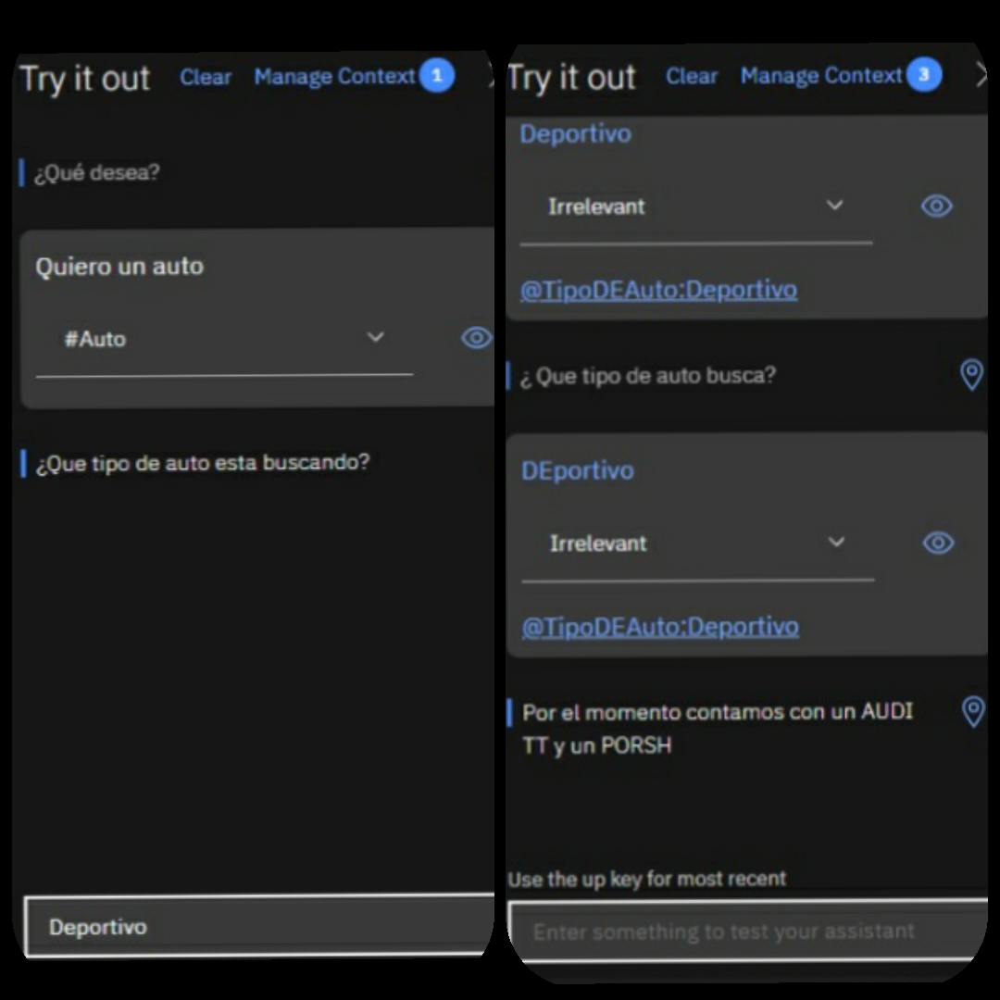
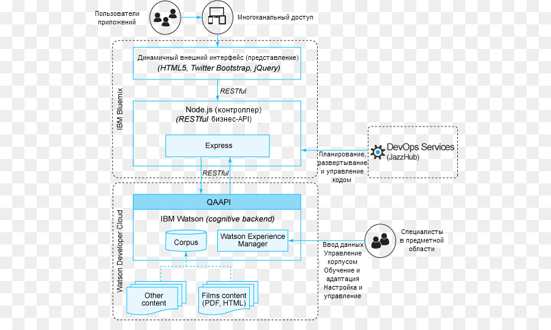
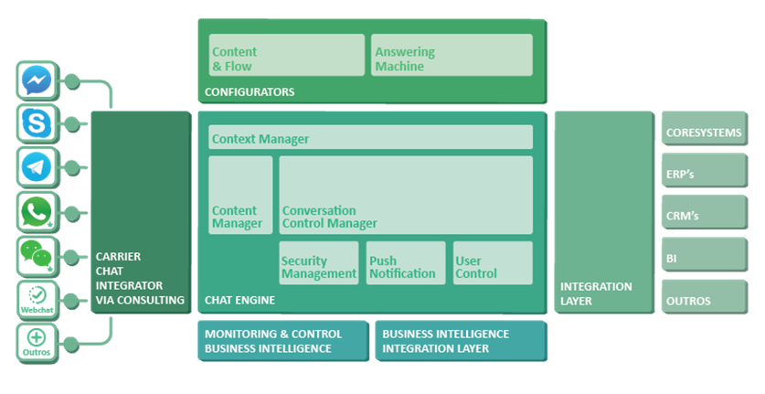
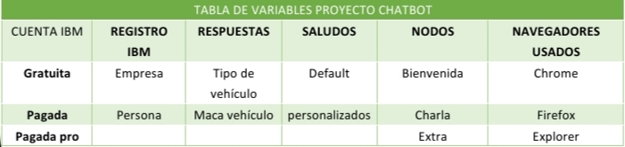
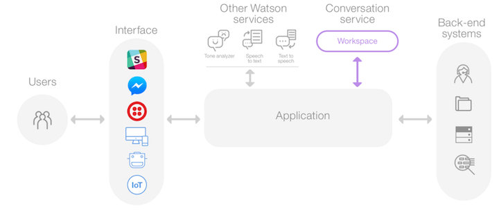
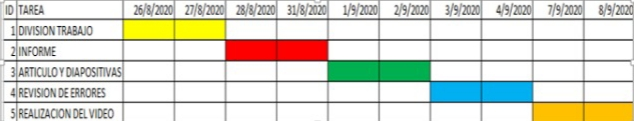

<H2>INFORME</H2>

<H3>1. PLANTEAMIENTO DEL PROBLEMA</H3>

Un bot de charla o bot conversacional (en inglés, chatbot) es un programa que simula mantener una conversación con una persona al proveer respuestas automáticas a entradas hechas por el usuario. Habitualmente, la conversación se establece mediante texto, aunque también hay modelos que disponen de una interfaz de usuario multimedia. Más recientemente, algunos comienzan a utilizar programas conversores de texto a sonido (CTV), dotándolo de mayor realismo a la interacción con el usuario.(Iescamp 2016).

Un chatbot es una aplicación de inteligencia artificial (IA) que puede imitar una conversación real conversation con un usuario con un lenguaje natural.Para establecer una conversación han de utilizarse frases fácilmente comprensibles y que sean coherentes, aunque la mayoría de los bot conversacionales no consiguen comprender del todo.(Wikipedia, 2020).

<H3>2. OBJETIVOS</H3>
<b>Objetivos Generales</b>

- Realizar un video en el cual se pueda ejemplificar el uso de un chatboy con IBM.

<b>Objetivos Específicos</b>

- REmplear las herramientas que nos brinda IBM Watson.

- Implementar un ejemplo funcional sobre un chatbot.

<H3>3. ESTADO DEL ARTE</H3>
<b>Implementación de Chatbot para ITSM
Aplicación que utiliza IBM Watson</b> 

En el escenario actual, el usuario final de Información
Aplicación de gestión de servicios tecnológicos (ITSM) en software
las empresas deben seguir buscando la solución a los problemas que
enfrenta o generar finalmente un ticket ya que no puede
colaborar con el sistema haciendo preguntas y obteniendo
respuestas relevantes. Como solución a esto, nuestro objetivo es diseñar un chatbot
que se adaptará específicamente a los empleados de empresas de software. los
El chatbot puede procesar la entrada mediante el procesamiento de lenguaje natural.
(PNL) y puede generar una respuesta relevante que ayude al
usuario final para resolver su consulta. El chatbot toma decisiones por sí mismo para
responder la consulta del usuario con la ayuda de IBM Watson
API de conversación. También recordará el contexto de la
conversación y realizar tareas como la creación de un ticket en
nombre del usuario.(Godse, N. A., Deodhar, S., Raut, S., & Jagdale, P. (2018)).  
 <b>Soporte para estudiantes multilingüe interactivo de voz
Sistema que utiliza IBM Watson</b> 
Los sistemas impulsados ​​por inteligencia artificial son
siendo desarrollado para ser más fácil de usar al comunicar
con los usuarios en una forma de conversación progresivamente "humana".
Chatbots, también conocidos como sistemas de diálogo, interactivos
agentes conversacionales, o agentes virtuales son un ejemplo de tales
sistemas utilizados en una amplia variedad de aplicaciones que van desde
atención al cliente en el ámbito empresarial a la compañía en
el sector de la salud. Cada vez es más importante
desarrollar chatbots que puedan responder mejor a las necesidades personalizadas
de sus usuarios, de modo que puedan ser tan útiles para el usuario como
posible de una manera humana real. Este artículo investiga y
compara tres ofertas populares de API de chatbots existentes y
luego proponer y desarrollar una voz interactiva y multilingüe
chatbot que puede responder eficazmente al estado de ánimo, el tono y
lenguaje utilizando IBM Watson Assistant, Tone Analyzer y
Traductor de lenguaje. El chatbot se evaluó mediante un uso
caso que estaba dirigido a responder a las necesidades de los usuarios con respecto a
estrés del examen basado en datos de encuestas de estudiantes universitarios generados
utilizando Formularios de Google. Los resultados de medir el chatbot
efectividad en el análisis de respuestas con respecto al estrés del examen
indicar que el chatbot responde de manera adecuada al usuario
consultas sobre cómo se sienten con respecto a los exámenes 76,5%. los
El chatbot también podría adaptarse para su uso en otras áreas de aplicación.
como centros de información para estudiantes, quioscos gubernamentales y
sistemas de apoyo a la salud.(Ralston, K., Chen, Y., Isah, H., & Zulkernine, F. (2019)).  
<b>Desarrollo y evaluación de un chatbot para
Museo Regional de Sao Jo ˜ ao del-Rei</b>

El uso de nueva información y comunicación
tecnologías (TIC) ha promovido cambios en la forma en que
se distribuye la información. Un desafío es explorar la integración de nuevas TIC, como teléfonos inteligentes y chatbots, para
difundir información dentro de un museo regional. En este papel,
propusimos el desarrollo de un chatbot al Regional
Museo de Sao Jo ˜ ao del Rei para presentar su ˜ más destacado
artefacto, una pintura llamada Retrato de menina. Este documento presenta
el diseño del chatbot en el que se implementó en IBM Watson
plataforma. Se realizó una evaluación con los usuarios aplicando el
Método del Mago de Oz. Los resultados de la evaluación evidenciaron
que el chatbot propuesto satisface a los usuarios, aunque es necesario
mejorar el flujo de comunicación para orientar a los usuarios en
la interacción del chatbot. Los resultados mostraron que implementar
varios chatbots (es decir, uno para cada artefacto del museo)
es mejor que hacer uno solo, porque así se evita
fallas en la determinación de contextos de diálogo y explorar más lúdico
estilos de interacción, como chatbots que pretenden ser los
carácter de algún artefacto.(Rezwan, S., Ahmed, W., Mahia, M. A., & Islam, M. R. (2018)).  

<H3>4. MARCO TEORICO</H3>
 <b>Chatbot
</b>
Los chatbots tienen su origen en 1966, cuando Joseph Weizenbaum creó el primer chatbot basado en inteligencia artificial, Eliza, que actuaba como terapeuta.Los más avanzados, son programas capaces de mantener una conversación lógica y pseudo inteligente en un determinado idioma. Algunos de los más complejos están programados en C++, Delphi o similares, y otros más sencillos en Action Script, PHP, VBScript, etc. Pueden ser consultados además de mediante software instalado en un ordenador personal, vía web y vía aplicaciones instaladas en teléfonos inteligentes (entre las mismas, cabe mencionar a Siri y SimSimi,entre otros muchos). Existen muchos otros con amplia presencia en redes de IRC, donde son conocidos como bots de charla o bots de chat.(RoboticaSchool,2020)

<b>IBM Watson</b>

•	Watson es un sistema informático para búsqueda de respuestas (question answering en inglés), desarrollado por IBM. La corporación lo describe como "una aplicación de tecnologías avanzadas diseñadas para el procesamiento de lenguajes naturales, la recuperación de información, la representación del conocimiento, el razonamiento automático, y el aprendizaje automático al campo abierto de búsquedas de respuestas," que es "construido en la tecnología DeepQA de IBM para la generación de hipótesis, la recopilación de pruebas masivas, el análisis y la calificación.Watson responde a las preguntas gracias a una base de datos almacenada localmente. La información contenida en esa base de datos proviene de multitud de fuentes, incluyendo enciclopedias, diccionarios, tesauros, artículos de noticias, y obras literarias, al igual que bases de datos externos, taxonomías, y ontologías (específicamente DBpedia, WordNet).(Wikipedia,2012-2018)

<H3>5. DIAGRAMAS</H3>

<H3>6. LISTA DE COMPONENTES</H3>
<b>IBM Watson</b>

- Accseso a internet

- Correo electronico

- Cuenta en IBM Watson

- Idea o nesecidad para plantear el chatbot

- Accseso a un computador

<H3>7. MAPA DE VARIABLES</H3>

<H3>8. EXPLICACION DEL CODIGO FUENTE</H3>
No tiene codigo fuente
<H3>9. DESCRIPCION DE PRERREQUISITOS Y CONFIGURACION</H3>
Se necesita una cuenta de IBM Watson la cual nos proporcionara las herramientas para la creacion de un chatbot,ademas de proporcionar las herramientas no mustra una guia basica para la creacion del chatbot

<H3>10. APORTACIONES</H3>
<b>Wifi</b>

El wifi (escrito también wi fi) es una tecnología que permite la interconexión inalámbrica de dispositivos electrónicos. Los dispositivos habilitados con wifi (tales como ordenadores personales, teléfonos, televisores, videoconsolas, reproductores de música, etcétera) pueden conectarse entre sí o a Internet a través de un punto de acceso de red inalámbrica. Wi-Fi es una marca de la Alianza Wi-Fi, la organización comercial que cumple con los estándares 802.11 relacionados con redes inalámbricas de área local. Su primera denominación en inglés fue Wireless Ethernet Compatibility Alliance (Hernandez, 2018).

<b>Tawk.to</b>

Es una aplicación de mensajería gratuita que le permite monitorear y conversar con los, visitantes en su sitio web, aplicación móvil o desde una página personalizable gratuita. Copie una línea simple de Javascript en el html de su sitio web y el widget de chat comienza a funcionar al instante.Inicie sesión en el panel para invitar a miembros de su equipo, crear accesos directos y comenzar a chatear con sus visitantes. Controle y rastree su progreso y el de sus equipos a lo largo del tiempo, revise el historial de chat y verifique el rendimiento en análisis.(Quarea, s.f.).

<H3>11. CONCLUSIONES</H3>
+ Se logró simular de manera exitosa ya que la misma plataforma nos presta un simulador en el cual se puede interactuar con el chatbot

+ Se logro identificar los principales elementos para la elaboracion de un chatbot y posteriroemente se logro implementar el cahtbot

+ Mediante la investigación y la implementación del ejercicio propuesto se llegó a conocer que varias de las herramientas proporcionadas por Watson son para el mejoramiento e implementación de detalles al chatbot

<H3>12. RECOMENDACIONES</H3>
Se recomienda crear una cuenta de IBM para poder constar de todos los benedificios de dicha herramienta ademas de que se encesita tener conocimientos aprendidos en la materia de arquitecura de computadoras ya que en base a ellos se puede realizar cualquier tipo de proyecto,
<H3>13. CRONOGRAMA</H3>

<H3>14. BIBLIOGRAFIA</H3>

Singh, P., & Saikia, S. (2016). Arduino-based smart irrigation using water flow sensor, soil moisture sensor, temperature sensor and ESP8266 WiFi module. 2016 IEEE Region 10 Humanitarian Technology Conference (R10-HTC). doi:10.1109/r10-.

Rezwan, S., Ahmed, W., Mahia, M. A., & Islam, M. R. (2018). IoT Based Smart Inventory Management System for Kitchen Using Weight Sensors, LDR, LED, Arduino Mega and NodeMCU (ESP8266) Wi-Fi Module with Website and App. 2018 Fourth International Conference on Advances in Computing, Communication & Automation (ICACCA).

Yamanoor, N. S., & Yamanoor, S. (2017). High quality, low cost education with the Raspberry Pi. 2017 IEEE Global Humanitarian Technology Conference

[4] Maria Sol Vicet Illas, «Historia y defincion de software libre en el mundo e lainformatica inicial,» Ecured.cu, Ecuador, 2017 Available:
https://www.ecured.cu/Software_libre#:~:text=Seg%C3%BAn%20la%20Free%20Software%20Foundation,programa%2C%20con%20cualquier%20prop%C3%B3sito%3B%20de

[5] N. SATHISH, KUMAR; B. VUAYALAKSHMI; R. JENIFER PRARTHANA; A. SHANKAR, « IOT BASED SMART GARBAGE ALERT SYSTEM USING ARDUINO UNO,» IEE, 2019
Available: https://ieeexplore.ieee.org/abstract/document/7848162

Eudoteca. (s.f.). Eudoteca. Obtenido de Tinkercad: https://www.educoteca.com/tinkercad.html

RoboticaSchool. (2020). RoboticaSchool. Obtenido de Arduino uno: https://www.robotica.school/curso/arduino-00/explicacion-hardware-arduino-uno/

Hernandez, L. d. (2018). ProgramarFacil. Obtenido de ESP8266 todo lo que necesitas saber del módulo WiFi para Arduino: https://programarfacil.com/podcast/esp8266-wifi-coste-arduino/#Especificaciones_del_chip_ESP8266

Microprocesador. (junio de 22 de 2020). Obtenido de Significados : https://www.significados.com/microprocesador/

Quarea. (s.f.). Obtenido de SBC: https://www.quarea.com/es/sbc-componente-indispensable

<H3>15. ANEXOS</H3>
<H3>15.1 MANUAL DE USUARIO</H3>
<H3>15.2 HOJAS TECNICAS</H3>
