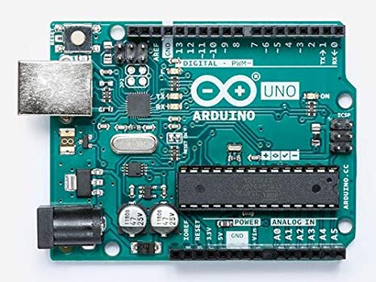
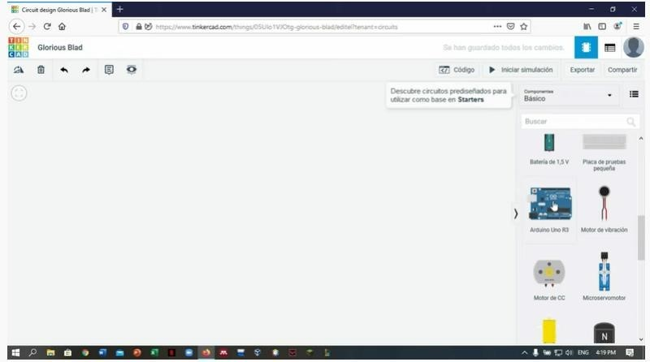
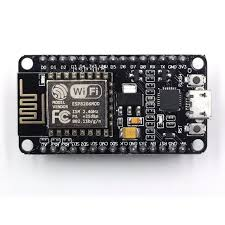
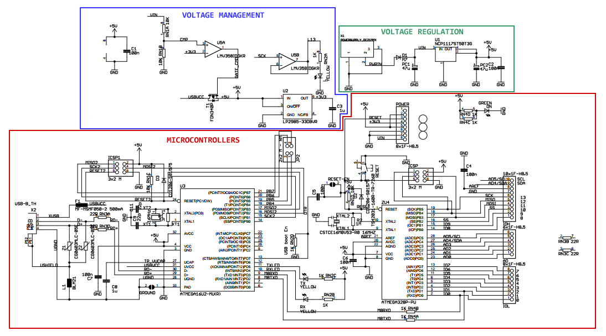
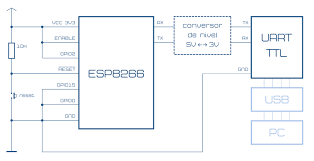
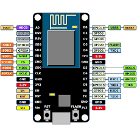

<H2>INFORME</H2>

<H3>1. PLANTEAMIENTO DEL PROBLEMA</H3>

El hardware de Arduino Uno es un circuito impreso o placa que contiene una MCU o microcontrolador y muchos otros componentes electrónicos que nos permite usar de forma fácil esta MCU en la vida real.También cómo ya hemos comentado las placas de Arduino al ser un hardware de diseño libre sus esquemas están disponibles en internet, para que cualquiera puede hacer su propia placa a su manera.Usar circuitos impresos de Arduino Uno para construir prototipos o proyectos finales como plataforma, es la mejor forma de garantizar la longevidad y continuidad del mismo(Iescamp 2016).

El ESP8266 es un chip de bajo costo Wi-Fi con un stack TCP/IP completo y un microcontrolador, fabricado por Espressif, una empresa afincada en Shanghái, China.El primer chip se hace conocido en los mercados alrededor de agosto de 2014 con el módulo ESP-01, desarrollado por la empresa AI-Thinker. Este pequeño módulo permite a otros microcontroladores conectarse a un red inalámbrica Wi-Fi y realizar conexiones simples con TCP/IP usando comandos al estilo Hayes.El ESP8285 es como un ESP8266 pero con 1 MB de memoria flash interna, para permitir a dispositivos de un chip conexiones de Wi-Fi.3.El sucesor de estos módulos es el ESP32.

<H3>2. OBJETIVOS</H3>
<b>Objetivos Generales</b>

- Desarrollar correctamente y bien explicado el tutorial de simulador de Arduino en Tinkercad.

<b>Objetivos Específicos</b>

- Realizar una indagacion Bibliografica sobre Arduino y ESP82.

- Describir los componentes y caracteristicas del Arduino.

<H3>3. ESTADO DEL ARTE</H3>
<b>Riego inteligente basado en Arduino utilizando sensor de flujo de agua, sensor de humedad del suelo, sensor de temperatura y módulo WiFi ESP8266</b> 

La computadora de placa única Raspberry Pi (SBC) ha ganado popularidad en diversas áreas, mientras que la educación sigue siendo el impulsor fundamental detrás del diseño. Bajo los kits de costos son provistos, específicamente para educación, por Fundación Raspberry Pi en conjunto con Google. Estos kits Modificaciones son usados para resultados educativos óptimos. El tutorial consiste en ejemplos de proyectos y ejemplos de código que pueden ser adaptado rápidamente para diversas situaciones de aprendizaje. Una lista de hardware o BOM, poblada y optimizada para un aprendizaje rentable y efectivo será proporcionado. La familia Raspberry Pi y la familia Arduino también se puede usar para educación, como alternativas o en combinación con la Raspberry Pi Zero y las diferencias serán destacadas y discutidas. Numerosas webs están en continua evolución de recursos, así como implementaciones de hardware financiadas por crowdfunding están disponibles para adaptarlos a la educación, la configuración se discutirá brevemente.   
Nuestro objetivo es describir el uso de Single Board Computadoras (SBC) como Raspberry Pi y Microcontroladores como Arduino en la creación rentable de soluciones para promover la educación STEM en países en desarrollo. Nuestra experiencia ha sido principalmente con Raspberry Pi y por eso escribimos sobre ese sistema. Esto no es una recomendación y es solo un modelo. Varios SBC y Los microcontroladores están disponibles en el mercado y potencialmente incluso los nuevos pueden diseñarse según sea necesario. Una comparación y un ajuste ideal para un conjunto dado de escenarios de instrucción son fuera del alcance de este trabajo. Hay varios recursos disponibles para este propósito(Yamanoor, N. S., & Yamanoor, S. (2017)).  
 <b>Diseño e implementacion de un hogar con sistema de automatizacion basado en teledeteccion tecnica con microcontrolador Arduino Uno</b> 
Este artículo propone y demuestra una forma económica y fácil de utilizar un sistema de riego controlado basado en arduino. El sistema se ocupa de varios factores ambientales como la humedad, temperatura y cantidad de agua requerida por los cultivos utilizando sensores como sensor de flujo de agua, sensor de temperatura y suelo, sensor de humedad. Los datos son recopilados y recibidos por arduino que se puede vincular a un sitio web interactivo que muestra los valores en tiempo real junto con los valores estándar de diferentes factor requerido por un cultivo. Esto permite al usuario controlar el riego. Bombas y rociadores a larga distancia a través de un sitio web y para cumplir con los valores estándar que ayudarían al agricultor a rendir cultivos máximos y de calidad. Estudios realizados en laboratorio. el prototipo sugirió que el sistema diseñado sea aplicable, el cual puede ser implementado.  
La evolución de la tecnología de la información ha abierto puertas a muchas imposibilidades. Con los años, nuestros teléfonos celulares, tabletas, automóviles, el auge de la tecnología "inteligente" ha consumido el mercado y se han convertido en el nuevo estándar en las industrias. El riego inteligente es una de esas tecnologías que ha atraído interés de muchos investigadores y está evolucionando y mejorando desde aproximadamente una década.Esta industria de riego inteligente donde el agua el desperdicio se minimiza y ya no es sostenible socialmente, económica y convencionalmente también(Singh, P., & Saikia, S. (2016)).  
<b>Sistema de gestión de inventario inteligente basado en IoT para Cocina con sensores de peso, LDR, LED, Wi-Fi Arduino Mega y NodeMCU (ESP8266) Módulo con sitio web y aplicación</b>

Sistema inteligente de gestión de inventario de cocina(SIMS) es un sistema basado en IoT, que hará manejo de inventario de cocina, medicina, restaurante más eficiente y sin problemas. Esto no solo notificará a los usuarios de su inventario actual, pero también ordena automáticamente nuevos artículos si la cantidad es baja. Los usuarios también pueden ordenar manualmente en línea para obtener cualquier artículo entregado en su puerta directamente desde sus SIMS aplicación El usuario también puede generar una lista de un período de tiempo determinado para que el usuario podrá saber sobre sus gastos. Además, el usuario puede rastrear el estado de su pedido y su historial a través del sitio web. Con la ayuda de Smart Kitchen Inventory (SKI), una parte de SIMS, la gente puede olvidarse de la molestia de comprar comestibles como puede ser operado desde cualquier lugar a través del sitio web o el Android aplicación y pedir todo lo que necesiten cuando lo deseen..  
La extensión de la tecnología es ineludible. Cada innovación se crea para tener un impacto constructivo en la vida de los humanos. En la era del avance tecnológico, todos los días se están construyendo nuevas ideas y prototipos que se están apoderando en algunos campos de nuestras actividades diarias. Estas tecnologías han facilitando la vida de todos, incluso más de lo que cualquiera puede pensar. Aunque la vida se hace más fácil, las personas también pasan más ocupadas a medida que pasa cada día. Las personas no tienen tiempo para simples tareas como ir de compras, que es simple pero necesario para una casa. A medida que avanzamos hacia la digitalización, nuestra vida y nuestros estilos de vida son cada vez más inteligentes. Ahí son múltiples dispositivos inteligentes ya disponibles en el mercado, como teléfono, TV, etc.Además, la cocina es un lugar importante en la casa que se compone de muchos dispositivos inteligentes que están destinados a proporcionar mejores servicios para un hogar. Es solo un asunto de tiempo que la gente va a necesitar un dispositivo inteligente para manejar sus comestibles. Anteriormente Samsung, LG hizo una nevera inteligente. Sin embargo, este refrigerador inteligente solo puede ayudar a ver lo que hay dentro de la nevera desde un lugar remoto y los usuarios tienen que ir de compras solos. Muchas personas habían trabajado previamente en el sistema de gestión de inventario de los hogares y E-shopping por separado(Rezwan, S., Ahmed, W., Mahia, M. A., & Islam, M. R. (2018)).  

<H3>4. MARCO TEORICO</H3>
<b>Arduino Uno
</b>
El Arduino Uno es una placa de microcontrolador de código abierto basado en el microchip ATmega328P y desarrollado por Arduino.cc. La placa está equipada con conjuntos de pines de E/S digitales y analógicas que pueden conectarse a varias placas de expansión y otros circuitos. La placa tiene 14 pines digitales, 6 pines analógicos y programables con el Arduino IDE (Entorno de desarrollo integrado) a través de un cable USB tipo B. Puede ser alimentado por el cable USB o por una batería externa de 9 voltios, aunque acepta voltajes entre 7 y 20 voltios. También es similar al Arduino Nano y Leonardo.El diseño de referencia de hardware se distribuye bajo una licencia Creative Commons Attribution Share-Alike 2.5 y está disponible en el sitio web de Arduino. Los archivos de diseño y producción para algunas versiones del hardware también están disponibles. La palabra "uno" significa italiano lo mismo que en español, y se eligió para marcar el lanzamiento inicial del software Arduino. La placa Uno es la primera de una serie de placas Arduino basadas en USB,  y la versión 1.0 del Arduino IDE fueron las versiones de referencia de Arduino, ahora evolucionadas a nuevas versiones.  El ATmega328 en la placa viene preprogramado con un cargador de arranque que le permite cargar un nuevo código sin el uso de un programador de hardware externo. Mientras que el Uno se comunica utilizando el protocolo STK500 original, difiere de todas las placas anteriores en que no utiliza el chip de controlador USB a serie FTDI. En cambio, usa el Atmega16U2 (Atmega8U2 hasta la versión R2) programado como un adaptador USB a serie.

<b>Componentes</b>

•	Conector USB

Los conectores USB (Universal Serial Bus) fueron desarrollados en el año 1994 por un grupo de siete compañías (Intel, Compaq, DEC, IBM, Microsoft, NEC y Nortel) en un esfuerzo de unificar toda la miríada de conectores que empleaban los periféricos en aquel tiempo, de manera que fuera más sencillo para los usuarios, poder conectarlos a sus ordenadores. Los primeros dispositivos que eran capaz de soportar el nuevo estándar se comercializaron de la mano de Intel en el año 1995. Y el primer Sistema Operativo que los soportaba de serie fue Windows 95.Los primeros USB 1.0 solo soportaban una velocidad de transferencia de archivos de 1,5 Mbps en modo de baja velocidad, y hasta 12 Mbps en modo de alta velocidad.

•	Regulador de voltaje de 5V

Es un dispositivo electrónico que tiene la capacidad de regular voltaje positivo de 5V a 1A de corriente, en la mayoría de los desarrollos con arduino o con programadores Pic estamos obligados a garantizar una fuente de tensión constante, eso disminuye la posibilidad de dañar nuestro circuito debido a oscilaciones en los niveles de tensión, la forma mas practica y simple de lograr esto es mediante el Regulador de voltaje 7805, básicamente es un dispositivo que cuenta con 3 pines.

•	Plug de conexión para fuente de alimentación externa

La fuente de alimentación o PSU (Power Supply Unit) es un elemento bastante importante en los equipos de sobremesa, ya que se encarga de suministrar y gestionar la energía en nuestro PC. Para ello, la obtiene del cable conectado a la red y mediante un transformador y una placa con circuitería, irá dando diferentes salidas de tensión para poder alimentar a cada componente interno de la caja o torre.
Cada una de esas salidas de tensión tienen diferentes conexiones o molex para conectar a la placa base, las unidades ópticas instaladas, los discos duros, etc. Estos conectores resultan vitales a la hora de elegir una fuente de alimentación, y no solo la potencia soportada o las tecnologías activas o pasivas de protección que tienen.(Wikipedia,2012-2018)

•	Puerto de conexiones

En informática, un puerto es una interfaz a través de la cual se pueden enviar y recibir los diferentes tipos de datos.La interfaz puede ser de tipo física (hardware) o puede ser a nivel lógico o de software, en cuyo caso se usa frecuentemente el término puerto lógico (por ejemplo, los puertos de redes que permiten la transmisión de datos entre diferentes computadoras).Se denomina “puerto lógico” a una zona o localización de la memoria de acceso aleatorio (RAM) de la computadora que se asocia con un puerto físico o un canal de comunicación, y que proporciona un espacio para el almacenamiento temporal de la información que se va a transferir entre la localización de memoria y el canal de comunicación.

•	Puertos de entradas análogas

Una señal eléctrica analógica es aquella en la que los valores de la tensión o voltaje varían constantemente y pueden tomar cualquier valor. En el caso de la corriente alterna, la señal analógica incrementa su valor con signo eléctrico positivo (+) durante medio ciclo y disminuye a continuación con signo eléctrico negativo (–) en el medio ciclo siguiente.

•	Microcontrolador ATmega 328

El Atmega328 AVR 8-bit es un Circuito integrado de alto rendimiento que está basado un microcontrolador RISC, combinando 32 KB (ISP) flash una memoria con la capacidad de leer-mientras-escribe, 1 KB de memoria EEPROM, 2 KB de SRAM, 23 líneas de E/S de propósito general, 32 registros de proceso general, tres temporizadores flexibles/contadores con modo de comparación, interrupciones internas y externas, programador de modo USART, una interfaz serial orientada a byte de 2 cables, SPI puerto serial, 6-canales 10-bit Conversor A/D (canales en TQFP y QFN/MLF packages), temporizador "watchdog" programable con oscilador interno, y cinco modos de ahorro de energía seleccionables por software. El dispositivo opera entre 1.8 y 5.5 voltios. Por medio de la ejecución de poderosas instrucciones en un solo ciclo de reloj, el dispositivo alcanza una respuesta de 1 MIPS, balanceando consumo de energía y velocidad de proceso(RoboticaSchool,2020).

•	Botón Reset

Es habitual que la idea de reset se emplee para nombrar al regreso de las condiciones originales de un sistema. Tomemos el caso de una computadora (ordenador). Cuando encendemos el equipo, se inicia el sistema operativo con una cierta configuración. Si luego de ejecutar diversas tareas deseamos volver al estado inicial, podemos apagar y volver a prender la computadora o, simplemente, pulsar la tecla de reset para reiniciar la máquina.

•	Pines de programación ICSP

ICSP es un conector consistente en 6 señales: MOSI, MISO, SCK, RESET, VCC, GND y además de ser un puerto para programar Arduino, también es el conector de expansión del bus SPI mediante el que también podemos comunicar periféricos y es usado en algunos casos para comunicar Arduino con los shields. Se puede considerar el ICSP como un “esclavo” del master del bus SPI del microcontrolador.En referencia a los microcontroladores AVR, el ICSP es la forma que tenemos de programarlos de forma in-system, conectando un programador a estos 6 pines. El programador manda el fichero hex ya compilador al microcontrolador mediante un protocolo concreto como puede ser el STK500.

•	Led ON

•	Leds de Recepción y Transmisión

•	Led pin 13

un diodo emisor de luz o led5(también conocido por la sigla LED, del inglés light-emitting diode) es una fuente de luz constituida por un material semiconductor dotado de dos terminales. Se trata de un diodo de unión p-n, que emite luz cuando está activado.Si se aplica una tensión adecuada a los terminales, los electrones se recombinan con los huecos en la región de la unión p-n del dispositivo, liberando energía en forma de fotones. Este efecto se denomina electroluminiscencia, y el color de la luz generada (que depende de la energía de los fotones emitidos) viene determinado por la anchura de la banda prohibida del semiconductor. Los ledes son normalmente pequeños (menos de 1 mm2) y se les asocian algunas componentes ópticas para configurar un patrón de radiación.(Wikipedia,2020)

•	Puertos de conexiones de pines de entradas o salidas digitales

l ATmega328p como cualquier otro microcontrolador tiene registros, algunos de estos registros están relacionados con los puertos de entrada/salida, cada puerto tiene un nombre específico y sus registros asociados, de hecho, el 328p tiene el puerto B, C y D, y cada puerto un diferente número de pines (Esta es una restricción del paquete de 28 pines PDIP y no desde el microcontrolador, ya que un PDIP 40 pines, por ejemplo, tiene 4 puertos con los 8 bits cada uno), el único puerto que tiene el total de sus 8 pines de entradas/salidas es PORTD.Cada pin puede tener múltiples funciones, como la generación de PWM, o las capacidades de ADC, los pines 6 y 7 del PORTB son los pines de entrada para el oscilador de cristal, y pin 6 del PORTC le corresponde al botón de reinicio.  En esta imagen se puede ver todas las funciones alternativas que cada pin puede tener.

•	Puerto de conexiones 5 entradas o salidas adicionales

Pero a bajo nivel estas funciones están manejando registros. Para empezar hay un registro dedicado para cada puerto que define si cada pin es una entrada o una salida, que es el registro de DDRX, donde x es la letra del puerto que queremos configurar, en el caso de la Arduino hay DDRB, DDRC y DDRD. Como toda variable lógica, cada bit en los registros DDRX puede ser 1 ó 0, poner un bit específico de DDRX a 1 configura el pin como salida y ponerla a 0 configura el pin como una entrada.

•	salida a tierra GND

La definición clásica de tierra (en inglés de Estados Unidos ground de donde viene la abreviación GND, earth en inglés de Reino Unido) es un punto que servirá como referencia de tensiones en un circuito (0 voltios)(Wikipedia,2012-2018).

•	pin AREF

En muchas ocasiones cuando estamos trabajando en nuestros proyectos electrónicos se es necesario trabajar a X voltaje de referencia. Supongamos que tenemos un sensor de temperatura LM35, este sensor ofrece una salida de tensión lineal con respecto a la temperatura, utiliza un factor de escala de 10 mV/°C. Imaginemos entonces que necesitamos este sensor para medir la temperatura de cierto lugar utilizando nuestro Arduino UNO. Para poder leer la temperatura del lugar necesitamos convertir la medida de temperatura que es una medida física a otra de tipo eléctronico. Este trabajo es el que precisamente hace el sensor. Ahora, el voltaje de salida que nos proporciona el LM35 es una señal analógica que debemos convertirla a una señal digital para poder procesarla, el mago que realiza este proceso se llama Conversor Analógico/Digital.

•	Chip de comunicación:

Este chip de comunicaciones multiprotocolo incorpora una gran selección de periféricos analógicos y digitales que pueden interactuar sin intervención de la CPU a través del sistema PPI (Programmable Peripheral Interconnect).Un esquema de mapeado flexible de GPIO de 31 pines permite E/S como, por ejemplo, interfaces serie, PWM, y demodulación de cuadratura para ser mapeado en cualquier pin de dispositivo tal y como dictan los requisitos PCB. Esto permite una total flexibilidad de diseño asociada con la ubicación pinout y la función.

https://www.tinkercad.com/

Tinkercad es un software gratuito online creado por la empresa Autodesk, una de las empresas punteras en el software de diseño 3D de la mano de su programa estrella para tal fin, Inventor.El objetivo al usar Tinkercad debe ser una primera inmersión en el mundo del diseño 3D de una manera sencilla y atractiva, ya que la interfaz de trabajo es simple y muy atractiva inicialmente, si bien una vez dominados los conceptos básicos carece de herramientas para llegar a diseños complejos.Sus ventajas son claras: es sencillo de usar, su aspecto es atractivo y con unas pocas horas de entrenamiento podemos adquirir mucha destreza en su uso.Como desventaja podríamos señalar que es necesario tener una cuenta de correo para darse de alta como usuario y que sólo posee una versión online, por lo que hace falta conexión a internet.Vamos a realizar una guía de manejo básico para dominar las herramientas más usuales de trabajo. Tras los videotutoriales tienes un tutorial redactado paso a paso.El aspecto del software al comenzar un nuevo diseño es el que se muestra en la imagen. Sin extendernos en mucha explicación: en la esquina superior izquierda tenemos el botón “Tinkercad” para volver a nuestra pantalla de inicio como usuarios, en la zona inferior de la misma tenemos botones para controlar el punto de vista de nuestro diseño y el zoom sobre el mismo (aunque ambas opciones se pueden realizar con los botones del ratón o trackpad). En la zona derecha tenemos una serie de menús desplegables con opciones de diseño directas (formas geométricas, letras, símbolos...). En la zona superior tenemos los iconos de deshacer y rehacer y una serie de accesos directos a herramientas de trabajo y de diseño que se explicarán más adelante. En el centro nos encontramos el plano de trabajo (“Workplane”)(Eudoteca,https://www.educoteca.com/tinkercad.html).

<b>EMP8266
</b>
Cuando salió el Arduino MKR1000, afirmé que revolucionaría el mundo de los objetos conectados, sobre todo por la facilidad de uso que caracteriza a estas placas. Acercaba de una manera sencilla el IoT a la población civil. Pero lo que está ocurriendo con el ESP8266, puede reventar las nuevas tendencias de muchos sectores. Se trata de un chip integrado con conexión WiFi y compatible con el protocolo TCP/IP. El objetivo principal es dar acceso a cualquier microcontrolador a una red. En este artículo haré referencia en varias ocasiones a Arduino y es que, sin duda alguna, es la competencia del Shield WiFi para esta placa. Pero no solo eso, Atmel, el fabricante que provee de microcontroladores a Arduino, sacó al mercado el ATSAMW25, competencia directa del ESP8266. Este microcontrolador es el que incorpora el Arduino MKR1000. La gran diferencia entre el ESP8266 y el ATSAMW25 es el precio. Mientras que podemos encontrar módulos con el chip ESP por 3€, el Arduino MKR1000 sale por unos 40€ con gastos de envío(Wikipedia, 2020).

<H3>5. DIAGRAMAS</H3>
<b>Aurduino uno</b>

•	Pines digitales: http://www.arduino.cc/en/Tutorial/DigitalPins, pueden configurarse como entrada (para leer, sensores) o como salida (para escribir, actuadores)
•	Pines analógicos de entrada: https://www.arduino.cc/en/Tutorial/AnalogInputPins, usan un conversor analógico/digital y sirven para leer sensores analógicos como sondas de temperatura.
•	Pines analógicos de salida (PWM): https://www.arduino.cc/en/Tutorial/PWM, la mayoría de Arduino no tienen conversor digital/analógico y para tener salidas analógicas se usa la técnica PWM. No todos los pines digitales soportan PWM.
•	Puertos de comunicación: USB, serie, I2C y SPI
•	SRAM: donde Arduino crea y manipula las variables cuando se ejecuta. Es un recurso limitado y debemos supervisar su uso para evitar agotarlo.
•	EEPROM:  memoria no volátil para mantener datos después de un reset o apagado. Las EEPROMs tienen un número limitado de lecturas/escrituras, tener en cuenta a la hora de usarla.
•	Flash: Memoria de programa. Usualmente desde 1 Kb a 4 Mb (controladores de familias grandes). Donde se guarda el sketch.
•	No necesita de un cable FTDI para conectarse al MCU, en su lugar uso una MCU ATMEGA16U2 especialmente programado para trabajar como conversor de USB a serie.
•	Alimentación: vía USB, batería o adaptador AC/DC a 5V, seleccionado automáticamente. Arduino puede trabajar entre 6 y 20V, pero es recomendado trabajar entre 7 y 12V por las características del regulador de tensión.
•	Puerto Serie en los pines 0 y 1.
•	Interrupciones externas en los pines 2 y 3.
•	Built-in LED en el pin 13.
•	Bus TWI o I2C en los pines A4 y A5 etiquetados como SDA y SCL o pines específicos
•	El MCU ATmega328P tiene un bootloader precargado que permite cargar en la memoria flash el nuevo programa o sketch sin necesidad de un HW externo.
•	Fusible rearmable de intensidad máxima 500mA. Aunque la mayoría de pc’s ya ofrecen protección interna se incorpora un fusible con la intención de proteger tanto la placa Arduino como el bus USB de sobrecargas y cortocircuitos. Si circula una intensidad mayor a 500mA por el bus USB(Intensidad máxima de funcionamiento), el fusible salta rompiendo la conexión de la alimentación.
•	Regulador de voltaje LP2985 de 5V a 3.3V que proporciona una corriente de alimentación máxima de 150 mA.
•	Regulador de voltaje NCP1117 que proporciona un valor estable de 5V a la placa y soporta por encima de 1 A de corriente. Datasheet:  http://www.onsemi.com/pub_link/Collateral/NCP1117-D.PDF
•	ATMEGA16U2 => Es el chip encargado de convertir la comunicación del puerto USB a serie.
•	Condensadores de 47µF de capacidad
•	Diodo M7 en la entrada de alimentación de la placa. Con este diodo conseguimos establecer el sentido de circulación de la intensidad, de esta forma si se produce una contracorriente debido a la apertura de un relé u otros mecanismos eléctricos, el diodo bloquea dicha corriente impidiendo que afecte a la fuente de alimentación.
•	DFU-ICSP. Puerto ICSP para el microcontrolador ATMEGA16U2, como en el caso del ATMEGA328P-PU se emplea para comunicarnos con el microcontrolador por el serial, para reflashearlo con el bootloader, hacer algunas modificaciones, ponerlo en modo DFU, etc..
•	JP2. Pines libres del ATMEGA16U2, dos entradas y dos salidas para futuras ampliaciones.
•	Encapsulados de resistencias.
•	RESET-EN: Significa Reset enabled o reset habilitado. Está habilitado el auto-reset, para deshabilitar por cualquier tipo de seguridad (por ejemplo un proyecto que tenemos funcionando y no queremos que nadie lo reinicie al conectar un USB y detecte un stream de datos) debemos desoldar los pads RESET-EN y limpiarlos de forma que estén aislados el uno del otro.
•	Cristal oscilador de 16MHz necesario para el funcionamiento del reloj del microcontrolador ATMEGA16U2.
•	Resonador cerámico de 16 Mhz para el microcontrolador ATMEGA328P-PU. Los resonadores cerámicos son menos precisos que los cristales osciladores, pero para el caso hace perfectamente la función y ahorramos bastante espacio en la placa. Se trata del pequeño, porque el cristal grande es para el 16U2 (Code, 28).

<b>ESP8266</b>

<H3>6. LISTA DE COMPONENTES</H3>
<b>Aurduino uno</b>

•	Conector USB

•	Regulador de voltaje de 5V

•	Plug de conexión para fuente de alimentación externa

•	Puerto de conexiones

•	Puertos de entradas análogas

•	Microcontrolador ATmega 328

•	Botón Reset

•	Pines de programación ICSP

•	Led ON

•	Leds de Recepción y Transmisión

•	Puertos de conexiones de pines de entradas o salidas digitales

•	Puerto de conexiones 5 entradas o salidas adicionales

•	salida a tierra GND

•	pin AREF

•	Led pin 13

•	Pines de programación ISCP

•	Chip de comunicación

<b>ESP8266</b>

CPU RISC de 32-bit: Tensilica Xtensa LX106 a un reloj de 80 MHz

•	RAM de instrucción de 64 KB, RAM de datos de 96 KB

•	Capacidad de memoria externa flash QSPI - 512 KB a 4 MB* (puede soportar hasta 16 MB)

•	IEEE 802.11 b/g/n Wi-Fi

o	Tiene integrados: TR switch, balun, LNA, amplificador de potencia de RF y una red de adaptación de impedancias

o	Soporte de autenticación WEP y WPA/WPA2

•	16 pines GPIO (Entradas/Salidas de propósito general)

•	SPI, IC,

•	Interfaz IS con DMA (comparte pines con GPIO)

•	Pines dedicados a UART, más una UART únicamente para transmisión que puede habilitarse a través del pin GPIO2

•	1 conversor ADC de 10-bit

<H3>7. MAPA DE VARIABLES</H3>

<H3>8. EXPLICACION DEL CODIGO FUENTE</H3>
<b>MELODIAS TACTILES DE UNA GUITARRA
</b>
input.onPinPressed(TouchPin.P2, function () {

    music.startMelody(music.builtInMelody(Melodies.Blues), MelodyOptions.Once)

})

input.onPinPressed(TouchPin.P1, function () {

    music.startMelody(music.builtInMelody(Melodies.Ode), MelodyOptions.Once)

})

Se usa lenguaje de programación en bloques y JavaScript, en bloques se realiza que cuando toque el Pin 1 se reproduzca una melodía llamada ODA y cuando se toque el pin 2 reproduzca una melodía llamada BLUES, dentro de javascript se realiza prácticamente lo mismo, únicamente mediante código. Se crea las funciones para PIN1 Y PIN2 y se da la acciona TOUCHPIN y la música que comenzara cuando se presione dicho PIN, por solo una vez.Para emplear de manera física se necesitara microbit y una batería de manera opcional, el editor makecode o Python, auriculares, 5 cables de clip de cocodrilo y opcional un cartón, papel de estano.

<b>ALARMA DE INCLINACION
</b>
function alarm () {

    basic.showIcon(IconNames.Angry)

    music.startMelody(music.builtInMelody(Melodies.Baddy), MelodyOptions.Once)

}

input.onGesture(Gesture.Shake, function () {

    radio.sendString("thief!")

    alarm()

})

radio.onReceivedString(function (receivedString) {

    alarm()

})

radio.setGroup(1)

Este microbit esta orientado a un tipo de alarma antirrobo de nuestras pertenencias.Se realizo mediante lenguaje de programacion de bloques y javascript, esto se ejecuta cuando el microbit sea agitado, un ejemplo ya sea dentro de un maletin alguien te lo roba y lo agita al maletin por ende el microbit sentira ese gesto y procedera a enviar una senal a otro microbit el cual puedes clonar con el mismo codigo y este le advertira mediante una “cara enojada” y un sonido que esta siendo robado su pertenencia. Se realiza mediante una funcion llamada alarma la cual sera que ejecute estas acciones.Para realizar de manera fisica vas a necesitar 2 microbits, 2 baterias, auriculares o altavoces y 2 cables de clip de cocodrilo.Dentro del codigo de javascript se procede a realizar la funcion alarma, la cual se le asigna que mostrara en el panel led, en este caso una cara enojada y el sonido que reproducira por una vez, por consiguiente se crea una funcion mas la cual asigna un gesto con el cual se active y sera AGITAR, en donde enviara una senal de “LADRON” al otro microbit y este lo recibira y se activara igualmente.

<b>SEMAFORO
</b>

Unicamente se lo realizo mediante el lenguaje de programacion por bloques, el cual indica que cada 3 segundos el semáforo en verde dentro del pasador 13 cambiara al siguiente pasador el cual pertenece al amarillo dentro del pasador 12 indicandole que parpapee 3 veces el amarillo durante 3 segundos cada uno, y para pasar como final al rojo dentro del pasador 11 el cual tomara 3 segundos y 10 milisegundos en apagarse y repetir el mismo proceso nuevamente.Para realizar esta practica de manera física se utilizo Arduino uno, placa de pruebas pequeña, 3 resistencias, 3 leds.

<b>Medidor de temperatura
</b>
// creamos una variable y le asignamos 0 como valor

int valor=0; 

void setup()

{

  //colocamos los bits por segundo

  Serial.begin(9600); 

}

void loop()

{

  //el valor que se leera sera del puerto analogo 1

  valor = analogRead(1); 

  //en esta variable creamos una ecuacion que nos permite leer

  //en el monitor serial valores similares a los grados

  float c = (valor-102)/2;

  //colocamos el nombre temperatura

  Serial.print("Temperatura: ");

  //imprimimos el resultado

  Serial.println(c);

  //si la temperatura en grados centigrados es menor que 15

  //se encendera el led azul

  if (c<15){

    digitalWrite(5,HIGH);

  }else{digitalWrite(5,LOW);

       }

  //si la temperatura es mayor o igual que 16 grados y menor que

  //30 grados entonces se encendera el led verde

  if (c>=16&&c<30){

    digitalWrite(3,HIGH);

  }else{digitalWrite(3,LOW);

       }

  //si c es menor que 50 y mayor que 30 entonces se encendera

  //el led amarillo

  if (c>=30&&c<50){

    digitalWrite(3,HIGH);

  }else{digitalWrite(3,LOW);

       }

  //si c es mayor que 50 entonces se encendera el led rojo

  if (c>50){

    digitalWrite(2,HIGH);

  }else{digitalWrite(2,LOW);

       }

}

En este ejercicio trataremos de simular un medidor de temperatura y condicionar a los leds, que representen cierta cantidad de temperatura es decir:

Temperaturas menor a 15 led azul

Temperaturas entre 16-30 led verde

Temperaturas entre 30-50 amarillo

Temperaturas mayores a 50 rojo.

Esto se realizo mediante código en TEXTO.

Para realizar de manera física usaremos Arduino uno, placa de pruebas pequeña, 4 leds, 4 resistencias, sensor de temperatura.

<b>Hallar el numero FIBONACCI
</b>
# Funcion para hallar el numero Fibonacci

def Fibonacci(n): 

	if n<0: 

		print("Ingreso Incorrecto") 

	# El primer numero Fibonacci es 0

	elif n==1: 

		return 0

	# El segundo numero Fibonacci es 1

	elif n==2: 

		return 1

	else: 

		return Fibonacci(n-1)+Fibonacci(n-2) 

# Driver Program 

print(Fibonacci(9)) 

# El resultado es 21

Según la sucesión de Fibonacci cada número es la suma de los dos anteriores, comenzando por 0 y 1, dará como resultado 21 respecto a 9. Se usa Python para definir el numero Fibonacci.

<b>Números primos en un intervalo</b>

# Programa en Python orientado a escribir los numeros primos en un intervalo

# Comienza en 11

start = 11

# Termina en 25

end = 25

for val in range(start, end + 1): 

	if val > 1: 

		for n in range(2, val//2 + 2): 

			if (val % n) == 0: 

				break

			else: 

				if n == val//2 + 1: 

					print(val) 
        
# El resultado es 11,13,17,19,23

Usaremos lenguaje de programacion Python en donde pondremos todos los números primos en un intervalo del 11 al 25 mediante for,if. Dando como resultado 11,13,17,19,23

<H3>9. DESCRIPCION DE PRERREQUISITOS Y CONFIGURACION</H3>
Se debe tener una cuenta en la plataforma de Tinkercad para poder utilizar sus servicios.
<H3>10. APORTACIONES</H3>
<b>SBC</b>

El SBC (Session Border Controller) es un nuevo componente al alcance de las empresas. Se puede instalar como un appliance o máquina virtual y dispone de funcionalidades que harán que su red de telefonía IP sea mucho más segura y se integre mejor con el equipamiento SIP de diferentes fabricantes y proveedores de servicios.
Básicamente, el SBC gestiona tanto la media como la señalización de las llamadas VoIP.
Las funciones principales de un SBC son las siguientes:
•    SEGURIDAD: Uno de los roles principales de estos equipos es proteger, mediante una de capa de seguridad adicional,  los puntos de entrada al sistema de voz ip desde las redes no seguras, evitando el hacking y los fraudes telefónicos. El SBC oculta al exterior la topología de red interna, actuando como un firewall pero con características más adecuadas para el tráfico multimedia.
•    ENCRIPTACIÓN: El uso cada vez más intensivo de las redes públicas para transportar VoIP hace que se incrementen los riesgos de que las comunicaciones puedan ser interceptadas de forma ilícita. Estas amenazas se pueden evitar utilizando los protocolos TLS (Transport Layer Security) y SRTP (Secure Real-Time Transport Protocol) para proteger la señalización y los canales de voz respectivamente. 
•    POLÍTICAS DE ACCESO: El uso no autorizado de los servicios VoIP pueden ser controlados aplicando y gestionando políticas mediante el SBC.
•    ENRUTAMIENTO DE LLAMADAS: El SBC permite configurar reglas de enrutamiento de llamadas que permitirán funcionalidades como el LCR (least cost routing) o el balanceo de carga entre diferentes SIP Trunk.
•    INTEROPERABILIDAD: Aunque SIP se considera un estándar, es extremadamente flexible y la realidad es que dos equipos basados en SIP no necesariamente se comunicaran de forma correcta.
•    MEDIA TRANSCODING: El transcoding es necesario para permitir que diferentes tipos de media crucen a través de equipos diversos y también para permitir un uso óptimo del ancho de banda disponible. Aunque el transcoding se puede hacer enteramente por software requiere un uso intensivo de la CPU y por tanto en sistemas de cierta capacidad es recomendable utilizar transcoding hardware.
•    DETECCIÓN/GENERACIÓN DE DTMF: La señalización DTMF (Dual Tone Multi Frequency) en redes de telefonía IP no siempre es sencilla, ya que algunos codecs no transmiten de forma fiable los tonos debido al uso de algoritmos de compresión con pérdida de ancho de banda que están optimizados para voz. El SBC dispone de la capacidad de implantar correctamente el método estándar RFC2833 para manejar este tipo de señalización(Quarea, s.f.).

<b>Microprosesador</b>

Se denomina microprocesador al circuito electrónico que procesa la energía necesaria para que el dispositivo electrónico en que se encuentra funcione, ejecutando los comandos y los programas adecuadamente. La Unidad Central de Procesos (CPU) de una computadora es un ejemplo de un microprocesador.Este componente electrónico forma parte de la tarjeta madre de una computadora y se caracteriza por ser un circuito integrado con miles y, a veces, hasta con millones de transistores.Se denomina micro por su significado inglés que indica “pequeño”, en relación a la importancia de su función en un dispositivo, comparado a veces con el cerebro y con el corazón de los seres humanos.Este componente electrónico es el encargado de procesar y ejecutar las instrucciones codificadas en números binarios.El microprocesador es comúnmente conocido como la Unidad Central de Procesos (CPU) de los diferentes dispositivos electrónicos, pero también contienen procesadores otros dispositivos como los discos duros.Es tan importante la función del microprocesador que actualmente es considerado el componente electrónico más influyente en la vida del ser humano.A nivel económico, es el producto más comercializado a nivel mundial y, a nivel social, es el objeto más utilizado, presente en una gran variedad de artefactos y componentes electrónicos, así como, computadores, teléfonos celulares, teléfonos inteligentes y tabletas(Microprocesador, 2020).

<b>Python</b>

Python es un lenguaje de programación interpretado cuya filosofía hace hincapié en la legibilidad de su código. Se trata de un lenguaje de programación multiparadigma, ya que soporta orientación a objetos, programación imperativa y, en menor medida, programación funcional. Es un lenguaje interpretado, dinámico y multiplataforma.Es administrado por la Python Software Foundation. Posee una licencia de código abierto, denominada Python Software Foundation License, que es compatible con la Licencia pública general de GNU a partir de la versión 2.1.1, e incompatible en ciertas versiones anteriores(Knowlton, Jim (2009)).

<b>Microcomputadoras</b>

 Una microcomputadora, un microcomputador o un microordenador es una computadora pequeña, con un microprocesador como su unidad central de procesamiento CPU. Generalmente, el microprocesador incluye los circuitos de almacenamiento (o memoria caché) y entrada/salida en el mismo circuito integrado (o chip). Las microcomputadoras se hicieron populares desde 1970 y 1980 con el surgimiento de microprocesadores más potentes. Los predecesores de estas computadoras, las supercomputadoras y las minicomputadoras, eran mucho más grandes y costosas (aunque las supercomputadoras modernas, como las IBM System z, utilizan uno o más microprocesadores como CPUs). Muchas microcomputadoras (cuando están equipadas con un teclado y una pantalla para entrada y salida) son también computadoras personales (en sentido general). La abreviatura micro fue comúnmente utilizada durante las décadas de 1970 y de 1980,aunque actualmente esté en desuso(Wikipedia, 2006-2017).

<H3>11. CONCLUSIONES</H3>
- Se pudo identificar la ventaja de tener aplicaciones para programación sin descargar nada

- Dentro de estas plataformas de simulación se pueden hacer cualquier tipo de algoritmos que posteriormente podemos enlazar con los microcomputadores.

-Se pudo aprender a realizar una programación orientada a objetos con una plataforma que usaba similar lenguaje al de scratch.

- Se pudo practicar y entender la programación con lenguaje de Python, que resultó ser más sencillo que los demás lenguajes.

- Verificamos que cada una de las plataformas son importantes, una nos brinda más facilidad al programar objetos y otras nos brinda la facilidad de usar un programa sin necesidad de tenerlo instalado.

<H3>12. RECOMENDACIONES</H3>

-Se recomienda crear una cuenta en cada una de las plataformas para poder tener nuestros archivos guardados

-Si se tiene un poco conocimiento de lenguajes y de programacion en general se recomienda usar la plataforma de simulacion de python,create with code

-Si es primera ves en el ambito de programacion se recomienda usar la plataforma tinkercad,ya que muestra una forma mas facil de programar atravez de los objetos

-Si lo que desea es simular un microprocesaodor o una microcomputadora la plataforma indicada es microbi.org

<H3>13. CRONOGRAMA</H3>

<H3>14. BIBLIOGRAFIA</H3>

Charlton, P., & Poslad, S. (2016). A Sharable Wearable Maker Community IoT Application. 2016 12th International Conference on Intelligent Environments (IE).

Abu Sulayman, I. I. M., Almalki, S. H. A., Soliman, M. S., & Dwairi, M. O. (2017). Designing and Implementation of Home Automation System Based on Remote

Yamanoor, N. S., & Yamanoor, S. (2017). High quality, low cost education with the Raspberry Pi. 2017 IEEE Global Humanitarian Technology Conference

[1} JORGE CACHO HERNÁNDEZ, «Raspberry Pi: tutoriales Servidor web, ownCloud y XBMC.,» 27 Enero 2008. [En línea]. Available: file:///C:/Users/home/Downloads/102190284-Raspberry-Pi-tutoriales-servidor-web-ownCloud-y-XBMC.pdf

[2] Microes, «Caracteristiac y funcionalidades de MicroBit,» Microes, 15 septiembre 2017. [En línea]. Available: http://microes.org/caracteristicas.php

[3] C. Muñoz, «Historia de la informatica “Raspberry Pi,» Blog sobre Historia de la Informática, 18 Diciembre 2013. [En línea]. Available: https://histinf.blogs.upv.es/2013/12/18/raspberry-pi/#:~:text=Raspberry%20PI%20es%20una%20placa,de%20la%20inform%C3%A1tica%20en%20las

[4] Maria Sol Vicet Illas, «Historia y defincion de software libre en el mundo e lainformatica inicial,» Ecured.cu, Ecuador, 2017 Available:
https://www.ecured.cu/Software_libre#:~:text=Seg%C3%BAn%20la%20Free%20Software%20Foundation,programa%2C%20con%20cualquier%20prop%C3%B3sito%3B%20de

[5] N. SATHISH, KUMAR; B. VUAYALAKSHMI; R. JENIFER PRARTHANA; A. SHANKAR, « IOT BASED SMART GARBAGE ALERT SYSTEM USING ARDUINO UNO,» IEE, 2019
Available: https://ieeexplore.ieee.org/abstract/document/7848162

Eudoteca. (s.f.). Eudoteca. Obtenido de Tinkercad: https://www.educoteca.com/tinkercad.html

Microes. (s.f.). Microes. Obtenido de MicroBit: http://microes.org/que-es-microbit.php

RoboticaSchool. (2020). RoboticaSchool. Obtenido de Arduino uno: https://www.robotica.school/curso/arduino-00/explicacion-hardware-arduino-uno/

Wikipedia. (2012-2018). Wikipedia. Obtenido de Raspberry pi: https://es.wikipedia.org/wiki/Raspberry_Pi#Raspberry_Pi_1_modelo_A_(descontinuada)

Withcode. (s.f.). whitcode. Obtenido de Create a with code: https://blog.withcode.uk/create-with-code-getting-started/

Code. (2019 de Noviembre de 28). Code,if. Obtenido de La placa microbit: http://code.intef.es/la-placa-microbit/

Google. (s.f.). Google Imagenes. Obtenido de Electronica y ciencia: https://www.google.com/search?q=explicacion+diagrama+electrico++raspberry

Pinterest. (s.f.). Pinterest. Obtenido de Pinterest: https://www.pinterest.com/teletrabajo/microbits-proyectos-e-ideas/

Microprocesador. (junio de 22 de 2020). Obtenido de Significados : https://www.significados.com/microprocesador/

Quarea. (s.f.). Obtenido de SBC: https://www.quarea.com/es/sbc-componente-indispensable

Wikipedia. (2006-2017). Wikipedia. Obtenido de Microcomputadoras: https://es.wikipedia.org/wiki/Microcomputadora#:~:text=Una%20microcomputadora%2C%20un%20microcomputador%20o,circuito%20integrado%20(o%20chip).

<H3>15. ANEXOS</H3>
<H3>15.1 MANUAL DE USUARIO</H3>
<H3>15.2 HOJAS TECNICAS</H3>
